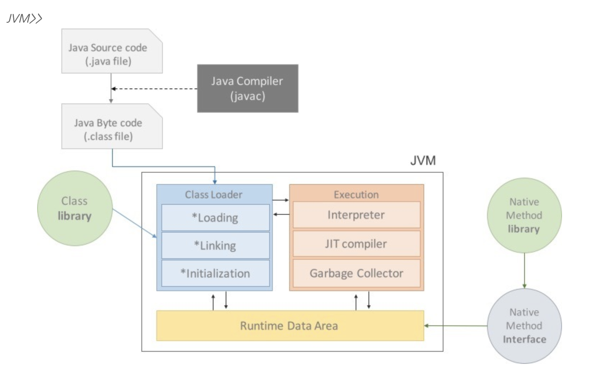
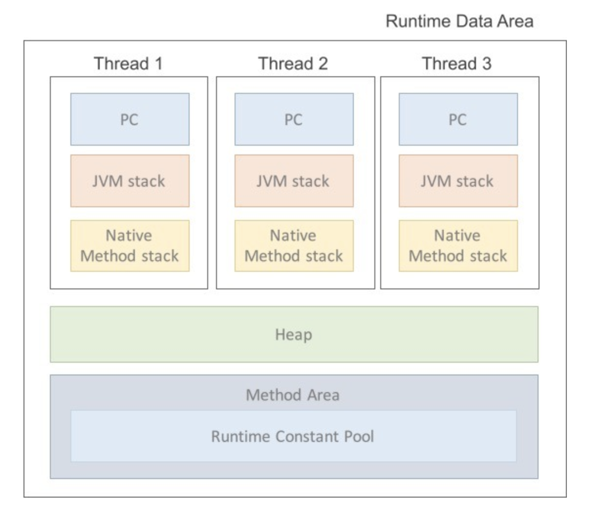
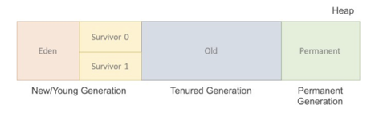

# JVM (Java Virtual Machine)

`write once, run everywhere`

- 스택 기반의 가상 머신.
- Java와 OS 사이에서 중개자 역할을 수행, OS에 구애받지 않고 사용 가능하게 해줌.
- 자바 애플리케이션을 클로스 로더를 통해 읽어들여 자바 API와 함께 실행하는 것.
- 메모리 관리, Garbage Collection(GC를 통한 자원관리)를 수행함.
- 자바 바이트 코드를 실행할 수 있는 주체.



## JVM을 알아야 하는 이유

- JVM이 하는 역할을 이해하면 메모리를 효울적으로 사용하고 최적의 성능을 낼 수 있음.  
- 한정된 메모리를 효율적으로 사용하고 최고의 성능을 내기 위해.
- 동일한 기능의 프로그램도 메모리 관리에 따라 성능이 좌우됨.

## Java 프로그램의 실행 과정

1. 프로그램이 실행되면 JVM은 OS로 부터 해당 프로그램이 필요로 하는 메모리를 할당 받음.  
  JVM은 이 메모리를 용도에 따라 여러 영역으로 나누어 관리함.
2. javac가 자바 소스 코드를 읽어 자바 바이트 코드(.class)로 변환시킴.
3. Class Loader가 class 파일들을 JVM으로 로딩함.
4. 로딩된 class 파일들은 Execution Engine을 통해 해석 됨.
5. 해석된 바이트 코드들은 Runtime Data Area에 배치되어 실질적인 수행이 이루어짐.  
  이러한 실행 과정속에서 JVM은 필요에 따라 Thread Synchronization과 GC 같은 관리 작업을 수행함.

```txt
  이게 맞는거야? 다시 확인 해볼 필요 있음.
```


## 각각의 역할

### Java Compiler

- Java Source 파일을 JVM이 해석할 수 있는 Java Byte Code(.class) 파일로 변경.

### Class Loader

- JVM 내로 .class 파일을 load.
- Load 된 클래스 파일들을 Runtime Data Area에 배치함
- 사용하지 않는 클래스들은 메모리에서 삭제됨.
- 동적 로드를 담당.

### Execution Engine (실행 엔진)

- Load 된 클래스의 byte code를 해석, OS에서 해석 가능한 Binary Code로 변경.
- 클래스를 실행시키는 역할.
- 클래스 로더가 JVM 내의 Runtime Data Area에 배치시킨 바이트코드를 실행엔진에 의해 실행 됨.
- 자바 바이트 코드(.claa 파일)는 비교적 인간이 보기 편한 형태로 기술됨.  
  실행 엔진은 이와 같은 바이트 코드를 실제 JVM 내부에서 기계가 실행할 수 있는 형태로 변경함.
- 실행 엔진은 자바 바이트 코드를 명령어 단위로 읽어서 실행함.
- 2가지 방식 존재
  - 최초의 JVM은 인터프리터 방식이었기 때문에 속도가 느린 단점이 존재했음.
  - JIT 컴파일러 방식이 나오면서 속도가 개선되었음.
  1. Interpreter
    - 자바 바이트 코드를 명령어 단위로 읽어서 실행.
    - 한 줄씩 실행하기 때문에 느림.
  2. JIT (Just In Time) Compiler
    - 인터프리터 방식의 단점을 보완하기 위해 등장.
    - 인터프리터 방식으로 실행하다가 적절한 시점에 바이트 코드 전체를 컴파일하여 네이티브 코드로 변경,  
      이후에는 더이상 인터프리팅하지 않고 네이티브 코드로 직접 실행하는 방식
    - 네이티브 코드는 캐시에 보관하기 때문에 한 번 컴파일된 코드는 빠르게 수행됨.
    - 한 번만 실행되는 코드라면 인터프리터로 실행하는게 더 빠르므로 유리함.
    - 이처럼 해당 메소드가 얼마나 자주 수행되는지 테크하고 일정 정도를 넘을 때만 컴파일을 수행하는 게 좋다.

### Garbage Collector

다음 문서에 작성 예정

### Runtime Data Area



- JVM이 프로그램을 실행하기 위해 OS로 부터 할당받은 메모리 공간.
- 이 공간은 용도에 따라 5개 영역으로 나눠 관리함.
1. PC Register
  - Thread가 시작될 때, 각각의 Thread 별로 생성되는 공간.
  - 현재 수행중인 JVM 명령어 주소를 가지고 있음.
  - CPU의 Register와 비슷한 역할.
2. Stack area
  - 각 스레드마다 하나씩 생성되는 공간.
  - Method 안에서 사용되는 값들이 저장되는 구역.(매개변수, 지역변수, 리턴 값 등)
  - 메소드가 호출될 때 LIFO 방식으로 하나씩 생성되고, 실행이 완료되면 지워진다.
3. Native Method Stack
  - Java 외의 언어로 작성된 네이티브 코드를 위한 영역.
  - 자바 프로그램이 컴파일 되어 생성되는 바이트 코드가 아닌, 실제 실행할 수 있는 기계어로 작성된 프로그램을 실행 시키는 영역.
  - JNI (Java Native Interface)라는 규약을 제공한다.
4. Method Area(Class Area, Static Area)
  - 클래스 정보를 처음 메모리 공간에 올릴 때, 초기화 되는 대상을 저장하기 위한 메모리 공간.
  - **모든 쓰레드가 공유**하는 메모리 영역.
    - 클래스, 인터페이스, 메소드, 필드, static 변수 등의 바이트 코드를 보관.
    - Runtime Constant Pool
      - 별도의 관리 영역으로 상수 자료형을 저장하여 참조하고 중복을 박는 역할을 수행
      - 각 클래스와 인터페이스의 상수, 메소드와 필드에 대한 모든 레퍼런스를 담고 있는 테이블
    - Java 7부터 String Constant Pool은 Heap 영역으로 변경되어 GC의 관리 대상이 되었음.
5. **Heap**
  
  * `new` 연산자로 생성된 객체를 저장하는 가상 메모리 공간. (런타임시 동적으로 할당)
  - 클래스 영역에 올라온 클래스들로만 객체를 생성 가능.
  - **GC의 관리 대상**.
  - 3개 영역으로 구분함.
    1. New/Young
      - Eden : 객체들이 최초로 생성되는 공간.
      - Survivor 0/1 : Eden에서 참조되는(사용되는) 객체들이 저장되는 공간.
      - Minor GC
        - Eden 영역에서 인스턴스가 가득차게 되면 첫 번째 GC가 발생.
        - Eden 영역에 있는 값들을 Survivor 1 영역에 복사하고, 나머지 객체를 삭제.
        - Minor GC를 반복 수행하며 Survivor에 살아남은 객체는 Old 영역으로 이동함.
    2. Old
      - New 영역에서 일정시간 참조되고 살아남은 객체들이 저장되는 공간.
      - Major GC의 대상 영역.
    3. Permanent Generation
      - 생성된 객체들의 주소 값이 저장되는 공간.
      - 리플렉션을 사용하여 동적으로 클래스가 로딩되는 경우 사용됨.
      - Major GC의 대상영역.
  

---
  
참고 :  
  1. [이승우님의 면접대비 지식 정리 github \[/Java/jvm\]](https://github.com/WooVictory/Ready-For-Tech-Interview/blob/master/Java/%5BJava%5D%20JVM.md)
  2. [피엔귄님의 블로그] (https://pienguin.tistory.com/entry/JAVA-자바-프로그램-실행-과정-및-기본-구조)