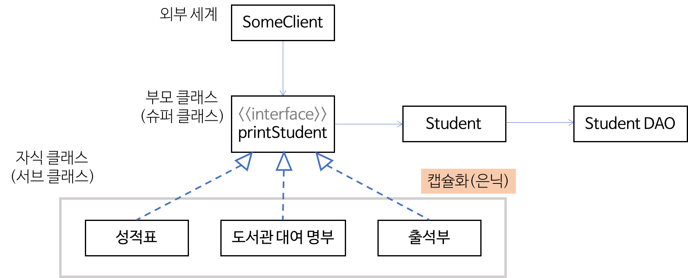

# Object Oriented Programming (OOP : 객체 지향 프로그래밍)

## 추상화 (Abstraction)

어떤 영역에서 필요로하는 속성이나 행동을 추출하는 것.

- 사물들의 공통된 특징, 추상적 특징을 파악해 인식의 대상으로 삼는 행위.
- 구체적인 사물들의 공통적인 특징을 파악해서 이를 하나의 개념으로 다루는 수단.

## 캡슐화 (Encapsulation)

`높은 응집도와 낮은 결합도를 유지할 수 있도록 설계해야 요구사항을 변경할 대 유연하게 대처할 수 있다.`

1. 응집도 (Cohension) : 클래스나 모듈 안의 요소들이 얼마나 밀접하게 관련되어 있는지를 나타냄.
2. 결합도 (Coupling) : 어떤 기능을 실행하는 데 다른 클래스나 모듈에 얼마나 의존적인지를 나타낸다.
  
캡슐화는 낮은 결합도를 유지할 수 있도록 해주는 객체지향 설계 원리다.  
정보 은닉을 통해 놉은 응집도와 낮은 결합도를 갖도록 할 수 있다.
  
- 정보 은닉 (information hiding)
  - 필요 없는 정보는 외부에서 접근하지 못하도록 제한
  - SW는 결합이 많을수록 문제가 많이 발생한다.
  - 한 클래스가 변경이 발생하면 변경된 클래스의 비밀에 의존하는 다른 클래스들도 변경해야 할 가능성이 높다.

- 변수화 함수를 하나의 단위로 묶는 것(bundling)을 의미.
- 해당 클래스의 인스턴스를 생성을 통해 클래스 안에 포함된 멤버 변수와 메소드에 접근한다.

## 일반화 관계 (Generalization)

`여러 개체들이 가진 공통된 특성을 부각시켜 하나의 개념이나 법칙으로 성립시키는 과정`

- 일반화 관계는 OOP 관점에서는 상속관계라고 한다.
- 속성이나 기능의 재사용만 강조해서 사용하는 케이스는 일반화 관계를 극히 한정되게 바라보는 시각이다.
- 일반화는 또 다른 캡슐화다
  - 일반화 한 관계는 한 클래스 안에 있는 속성 및 연산들의 캡슐화에 한정되지 않는다.
  - 외부 세계에 자식 클래스 자체를 캡슐화하는 것(은닉)으로 확장된다.
  - 서브 클래스의 캡슐화는 외부 클라이언트가 개별적인 클래스들과 무관하게 프로그래밍을 할 수 있게 한다.

## 다형성 (Polymorphism)

`다형성은 서로 다른 클래스의 객체가 같은 메세지를 받았을 때 각자의 방식으로 동작하는 능력이다.`
  
- 다형성이 상속과 연계되어 동작을 하면 매우 강력한 힘을 발휘한다.
- 다형성과 일반화 관계는 코드를 간결하게 할 뿐 아니라 변화에도 유연하게 대처할 수 있게 한다.
- 다형성을 사용하는 경우 구체적으로 현대 어떤 클래스 객체가 참조되는지와 무관하게 프로그래밍 할수 있다.
- 일반화 관계에 있을 때 부모 클래스의 참조 변수가 자식 클래스의 객체를 참조할 수 있기 때문에 새로운 자식 클래스가 추가되더라도 코드는 영향을 받지 않는다.
- 단, 부모 클래스의 참조 변수가 접근할 수 있는 것은 부모 클래스가 물려준 변수와 메소드 뿐이다.

### 피터 코드 (Peter Coad)의 상속 규칙

상속의 오용을 막기 위해 상속의 사용을 엄격하게 제한하는 규칙.  
어느 하나라도 만족하지 않는다면 상속을 사용해서는 안된다.

1. 자식 클래스와 부모 클래스 사이에는 '역할 수행' 관계가 아니어야 한다.
2. 한 클래스의 인스턴스는 다른 자식 클래스의 객체로 변환할 필요가 절대 없어야 한다.
3. 자식 클래스가 부모 클래스의 책임을 무시하거나 재정의하지 않고 확장만 수행해야 한다.
4. 자식 클래스가 단지 일부 기능을 재사용할 목정으로 유틸리티 역할을 수행하는 클래스를 상속하지 않아야 한다.
5. 자식 클래스가 '역할', '트랜잭션', '디바이스' 등을 특수화 해야 한다.
  
---
  
## OOP 설계 5원칙 SOLID

- S (SRP, Single Responsibility Principle) : 단일 책임 원칙
- O (OCP, Open Closed Principle) : 개방-폐쇄 원칙
- L (LSP, Liskov Substitution Principle) : 리스코프 치환 원칙
- I (ISP, Interface Segregation Principle) : 인터페이스 분리 원칙
- D (DIP, Dependency Inversion Principle) : 의존 역전 원칙

### S (SRP, Single Responsibility Principle) : 단일 책임 원칙

`객체는 단 하나의 책임만 가져야 한다. (객체는 오직 하나의 변경 이유를 가져야 한다.)`
  
- 책임 : 해야하는 것
- 책임 분리 : 찬 클래스에 단 하나의 책임만 수행하도록 해 변경 사유가 도리 수 있는 것을 하나로 만들어야 한다.  
  책임이 많아질 수록 클래스 내부에서 서로 다른 역할을 수행하는 코드끼리 강하게 결합될 가능성이 높아진다.

#### 산탄총 수술

- 하나의 책임이 여러개의 클래스들로 분산되어 있는 경우에도 단일 책임 원칙에 입각해 설계를 변경해야 한다.
  - 예를 들어 로깅, 보안, 트랜잭션과 같은 횡단 관심으로 분류할 수 있는 기능.
  - 횡단 관심에 속하는 기능은 대부분 시스템 핵심 기능(하나의 책임) 안에 포함되는 부가기능이다.
- 부가 기능을 별개의 클래스로 분리해 책임을 담당하게 한다.
  - 여러 곳에 흩어진 공통 택임을 한 곳에 모으면 응집도를 높인다.
  - AOP로 확장

### O (OCP, Open Closed Principle) : 개방-폐쇄 원칙

`객체는 확장에 열려있고, 변화에는 닫혀 있어야 한다.`

- 의존 역전의 법칙(DIP)와 밀접하다고 할 수 있다.
- 캡슐화(은닉)과도 연결된다.
- OCP에 위반되지 않는 설계를 할 때 가장 중요한 것은 무엇이 변하는 지, 무엇이 변하지 않는 것인지를 구분해야 한다는 점이다.
  - 변해야 하는 것은 쉽게 변할 수 있게 하고, 변하지 않아야 할 것은 변하는 것에 영향을 받지 않게 해야 한다.

### L (LSP, Liskov Substitution Principle) : 리스코프 치환 원칙

`자식 클래스는 언제나 부모 클래스를 대체할 수 있어야 한다.`

- 부모 자식 클래스 사이의 행위에 일관성이 있어야 한다는 의미다.
- LSP를 만족하면 프로그램에서 부모 클래스의 인스턴스를 자식 클래스의 인스턴스로 대체해도 프로그램의 수행은 변화하지 않는다.
- 코드 상속 규칙 -> `자식 클래스가 부모 클래스의 책임을 무시하거나 재정의 하지 않고 확장만 수행한다`

### I (ISP, Interface Segregation Principle) : 인터페이스 분리 원칙

`클라이언트는 자신이 이용하지 않는 기능에 영향을 받지 않아야 한다.`

- SRP와 이어지는 개념이다.
- 어떤 클래스가 여러 책임을 수행하게 되면 방대한 메소드를 가진 비대한 클래스가 될 가능성이 커진다.
- 이렇게 비대한 클래스를 단일 책임을 갖는 여러 클래스로 분할하면 SRP를 만족한다.
- 각자의 인터페이스를 제공한다면 ISP를 만족할 수 있다.
- 예 ) 복합기는 프린터, 복사기, 팩스 등의 기능을 인터페이스로 분리해서 가지고 있어야 관리와 사용이 편하다.

### D (DIP, Dependency Inversion Principle) : 의존 역전 원칙

`의존 관계를 맺을 때, 변화하기 쉬운 것 또는 자주 변화하는 것 보다는 변화하기 어려운 것, 거의 변화가 없는 것에 의존하라.`

- OCP가 되려면 기본적으로 DIP가 되어야 한다.
- DIP를 만족시키는 방법
  - 어떤 클래스가 도움을 받을 때 구체적인 클래스 보다는 인터페이스나 추상 클래스와 의존 관계를 맺도록 설계해야 한다.
- DIP를 만족하는 설계는 변화에 유연한 시스템이 된다.
  - DI, IOC는 제어의 흐름에 대한 개념이고, DIP는 클래스 사이의 의존성에 대한 개념이다. 혼동해서는 안된다.
- 고수준의 클라이언트는 저수준의 클래스에서 추상화한 인터페이스만 바라보기 때문에, 이 인터페이스를 구현한 클래스는 클라이언트에 어떤 변경도 없이 얼마든 교체될 수 있다.(디자인 패턴 중 전략 패턴 참고)

---
  
참고 :  
  - https://gmlwjd9405.github.io/2018/07/05/oop-features.html